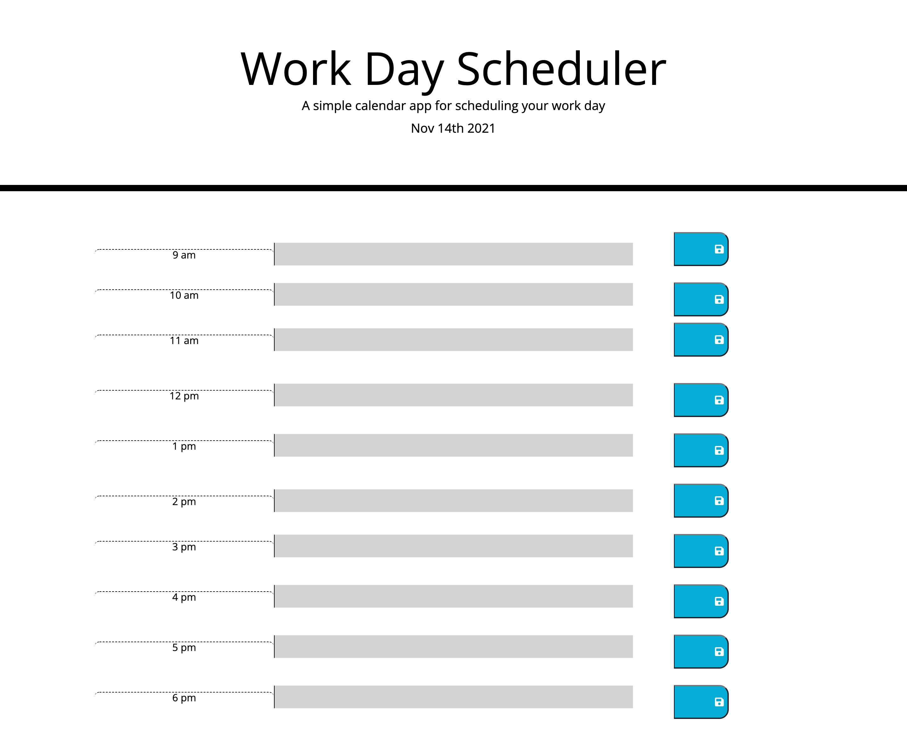

# Starter Code
# Challenge #3 - Work Day Scheduler

## Description

    This project was about using various JavaScript tools alongside JQuery and BootStrap to create a dynamic schedule for the average workday. This program should change background colors of the input areas according to the time of day (past is gray, present is red, and future is green). It is able to take in user input in any of the central boxes and should store it to local storage, then retrieve it on a page refresh. The last minor feature is displaying the current day just under the text of the header.

## Experience Gained

    This challenge was particularly difficult for me, as I struggled a quite a bit with getting the background colors to change correctly depending on the time of day. They do change, but all at the same time, rather than in sections. I was able to get user input for the central column, as well as display the current date at the top, but my save buttons are still in need of some work. The save button can save the very first item of the column (9am), but does not seem to read any of the others, even if there is input. This tell me that I need to revisit this in office hours and see why it is not working appropriately.
    Unfortunately, this challenge will need to be resubmitted after further modifications to the code.

## GitHub Links (Deployed Site and Repository)

    The project deployment can be seen at: https://ekball.github.io/C5-Work-Day-Scheduler/

    The repository link: https://github.com/ekball/C5-Work-Day-Scheduler

## Deployed Site Screenshot

